# 2.2. Module Quản lý Loại Phòng

---

## 2.2.1. Giới thiệu chức năng quản lý loại phòng

Chức năng quản lý loại phòng được thiết kế nhằm hỗ trợ chủ nhà phân loại các không gian thuê (phòng đơn, phòng đôi, căn hộ studio...) một cách khoa học. Hệ thống cho phép thiết lập giá thuê niêm yết và các tiện ích đi kèm cho từng loại phòng, giúp khách thuê dễ dàng lựa chọn và làm cơ sở gắn vào từng phòng cụ thể.

### Tác nhân và biểu đồ ca sử dụng

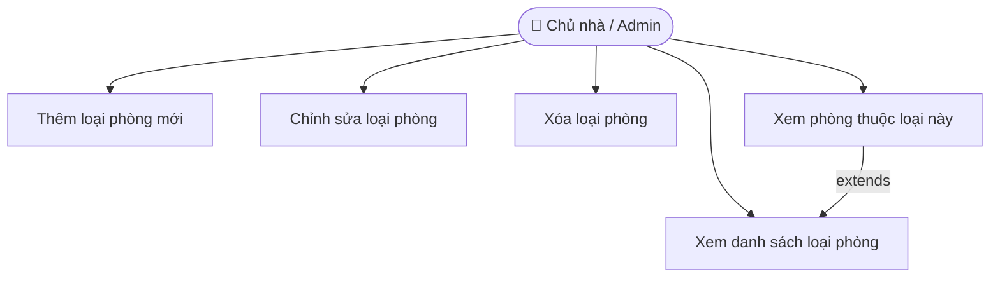

> **Hình X. Biểu đồ ca sử dụng chức năng Quản lý Loại Phòng**

---

## 2.2.2. Thiết kế cơ sở dữ liệu quản lý loại phòng

**Mục đích:** Lưu trữ các cấu hình chung cho từng nhóm phòng (VD: Phòng VIP, Studio).  
**Tên bảng:** `room_types`

| STT | Diễn giải | Tên trường | Kiểu dữ liệu | Ràng buộc | Ghi chú |
|-----|-----------|------------|--------------|-----------|---------|
| 1 | Mã loại phòng | id | bigint | PK | Tự động tăng |
| 2 | Tên loại phòng | name | varchar(255) | Not Null | VD: Phòng VIP, Studio |
| 3 | Giá thuê mặc định | default_price | decimal(12,0) | Not Null | Mặc định: 0, đơn vị VNĐ/tháng |
| 4 | Mô tả tiện ích | description | text | Nullable | AC, Wifi, Ban công... |
| 5 | Ngày tạo | created_at | timestamp | | |
| 6 | Ngày cập nhật | updated_at | timestamp | | |

---

## 2.2.3. Quy trình quản lý loại phòng

Quản lý loại phòng bao gồm các thao tác chính như thêm mới loại phòng, chỉnh sửa thông tin, xóa và hiển thị danh sách các loại phòng trong hệ thống. Chi tiết các thao tác như sau:

### Thêm mới loại phòng

| Thành phần | Nội dung chi tiết |
|------------|-------------------|
| **Mục đích** | Thêm một loại phòng mới vào hệ thống để quản lý và làm căn cứ thiết lập giá thuê, tiện ích. |
| **Các bước thực hiện** | 1. Chủ nhà chọn tính năng **Thêm mới loại phòng** trên giao diện quản trị.<br>2. Nhập các thông tin: Tên loại phòng (VD: Phòng VIP), Giá thuê mặc định, Mô tả tiện ích.<br>3. Hệ thống kiểm tra tính hợp lệ (Tên loại phòng không được để trống).<br>4. Hệ thống lưu thông tin vào cơ sở dữ liệu và cập nhật danh sách hiển thị. |
| **Tham chiếu** | Bảng dữ liệu: `room_types` |

### Chỉnh sửa loại phòng

| Thành phần | Nội dung chi tiết |
|------------|-------------------|
| **Mục đích** | Chỉnh sửa thông tin loại phòng hiện có để đảm bảo dữ liệu luôn chính xác. |
| **Các bước thực hiện** | 1. Chủ nhà chọn mục **Sửa** tại loại phòng cần thay đổi trong danh sách.<br>2. Thực hiện cập nhật: Tên loại phòng, giá thuê mặc định hoặc mô tả tiện ích.<br>3. Hệ thống kiểm tra tính hợp lệ của dữ liệu mới.<br>4. Hệ thống lưu lại thay đổi và làm mới danh sách hiển thị. |
| **Tham chiếu** | Bảng dữ liệu: `room_types` |

### Xóa loại phòng

| Thành phần | Nội dung chi tiết |
|------------|-------------------|
| **Mục đích** | Loại bỏ thông tin loại phòng không còn hoạt động để duy trì cơ sở dữ liệu gọn gàng. |
| **Các bước thực hiện** | 1. Chủ nhà chọn tính năng **Xóa** tại loại phòng cụ thể trong hệ thống.<br>2. Hệ thống hiển thị thông báo xác nhận: *"Bạn có chắc chắn muốn xóa loại phòng này?"*<br>3. Hệ thống kiểm tra ràng buộc: Nếu còn phòng cụ thể đang thuộc loại phòng này thì từ chối xóa và hiển thị cảnh báo.<br>4. Hệ thống thực hiện xóa khỏi cơ sở dữ liệu sau khi xác nhận hợp lệ.<br>5. Cập nhật và làm mới danh sách hiển thị. |
| **Tham chiếu** | Bảng dữ liệu: `room_types`, `rooms` |

---

## 2.2.4. Thiết kế quy trình nghiệp vụ

### Biểu đồ tuần tự — Chức năng Quản lý Loại Phòng

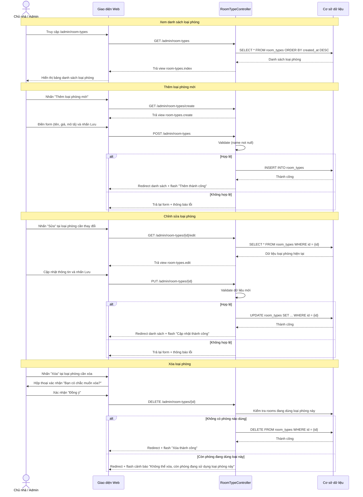

> **Hình X. Biểu đồ tuần tự chức năng Quản lý Loại Phòng**

---

## 2.2.5. Thiết kế giao diện quản lý loại phòng

Giao diện quản lý loại phòng gồm các phần chính: thanh điều hướng bên trái, bảng danh sách loại phòng và chức năng thêm/sửa/xóa. Bảng danh sách hiển thị các thông tin từ cơ sở dữ liệu như tên loại phòng, giá thuê mặc định, mô tả tiện ích và số lượng phòng thuộc loại đó. Phần thêm/sửa loại phòng cung cấp form nhập liệu với các trường: tên loại phòng, giá thuê mặc định và mô tả tiện ích. Giao diện giúp người quản lý phân loại hệ thống phòng trọ một cách rõ ràng, nhanh chóng và hiệu quả.

> **Hình X. Giao diện Quản lý Loại Phòng**

---

# 2.3. Module Quản lý Phòng

---

## 2.3.1. Giới thiệu chức năng quản lý phòng

Chức năng quản lý phòng được thiết kế nhằm hỗ trợ chủ nhà theo dõi và vận hành toàn bộ hệ thống phòng trọ một cách hiệu quả. Hệ thống cho phép thêm mới, chỉnh sửa, xóa và tra cứu thông tin từng phòng thuộc các khu trọ, bao gồm tên/số phòng, tầng, diện tích, giá thuê thực tế, số người tối đa và trạng thái (Trống / Đang thuê / Đang bảo trì). Ngoài ra, hệ thống liên kết phòng với loại phòng đã được phân loại sẵn, giúp chủ nhà dễ dàng lọc, tìm kiếm và nắm bắt tình trạng khai thác của từng phòng theo thời gian thực.

### Tác nhân và biểu đồ ca sử dụng

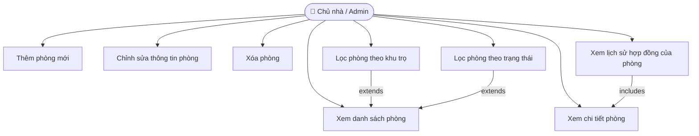

> **Hình X. Biểu đồ ca sử dụng chức năng Quản lý Phòng**

---

## 2.3.2. Thiết kế cơ sở dữ liệu quản lý phòng

**Mục đích:** Lưu trữ thông tin chi tiết của từng phòng thuộc các khu nhà trọ trong hệ thống.  
**Tên bảng:** `rooms`

| STT | Diễn giải | Tên trường | Kiểu dữ liệu | Ràng buộc | Ghi chú |
|-----|-----------|------------|--------------|-----------|---------|
| 1 | Mã phòng | id | bigint | PK | Tự động tăng |
| 2 | Mã khu trọ | house_id | bigint | FK, Not Null | Tham chiếu bảng `houses` |
| 3 | Mã loại phòng | room_type_id | bigint | FK, Nullable | Tham chiếu bảng `room_types` |
| 4 | Tên / Số phòng | name | varchar(255) | Not Null | VD: P101, P201 |
| 5 | Tầng | floor | int | Not Null | Mặc định: 1 |
| 6 | Giá thuê thực tế | price | decimal(12,0) | Not Null | Đơn vị: VNĐ/tháng |
| 7 | Diện tích | area | decimal(8,2) | Nullable | Đơn vị: m² |
| 8 | Số người tối đa | max_occupants | int | Not Null | Mặc định: 4 |
| 9 | Trạng thái phòng | status | enum | Not Null | available / rented / maintenance |
| 10 | Mô tả | description | text | Nullable | Ghi chú thêm về phòng |
| 11 | Ảnh phòng | image_path | varchar(255) | Nullable | Đường dẫn ảnh |
| 12 | Ngày tạo | created_at | timestamp | | |
| 13 | Ngày cập nhật | updated_at | timestamp | | |

---

## 2.3.3. Quy trình quản lý phòng

Quản lý phòng bao gồm các thao tác chính như thêm mới phòng, chỉnh sửa thông tin, xóa phòng và hiển thị danh sách với bộ lọc theo khu trọ và trạng thái. Những chức năng này giúp chủ nhà tổ chức, theo dõi và cập nhật tình trạng hệ thống phòng trọ một cách khoa học, chính xác và thuận tiện. Chi tiết các thao tác như sau:

---

### Thêm mới phòng

Hệ thống cho phép chủ nhà nhập thông tin phòng mới thuộc một khu trọ cụ thể, bao gồm số phòng, tầng, giá thuê, diện tích và tình trạng ban đầu.

| Thành phần | Nội dung chi tiết |
|------------|-------------------|
| **Mục đích** | Thêm một phòng mới vào hệ thống để quản lý cho thuê và gắn với hợp đồng khi có khách thuê. |
| **Các bước thực hiện** | 1. Chủ nhà chọn chức năng **Thêm phòng mới** trên giao diện quản trị.<br>2. Nhập các thông tin: Khu trọ (House), Loại phòng (Room Type), Tên/số phòng, Tầng, Giá thuê, Diện tích, Số người tối đa, Trạng thái, Mô tả.<br>3. Hệ thống kiểm tra tính hợp lệ (Tên phòng không trống, giá thuê là số dương, khu trọ phải tồn tại).<br>4. Hệ thống lưu thông tin vào cơ sở dữ liệu và cập nhật danh sách hiển thị. |
| **Tham chiếu** | Bảng dữ liệu: `rooms`, `houses`, `room_types` |

---

### Chỉnh sửa thông tin phòng

Hệ thống cho phép thay đổi thông tin phòng khi có điều chỉnh về giá thuê, diện tích hoặc tình trạng phòng.

| Thành phần | Nội dung chi tiết |
|------------|-------------------|
| **Mục đích** | Cập nhật thông tin phòng hiện có để đảm bảo dữ liệu luôn phản ánh đúng thực tế tại thời điểm quản lý. |
| **Các bước thực hiện** | 1. Chủ nhà chọn nút **Sửa** tại phòng cần thay đổi trong danh sách.<br>2. Thực hiện cập nhật: Tên phòng, giá thuê, diện tích, trạng thái (available / rented / maintenance) hoặc mô tả.<br>3. Hệ thống kiểm tra tính hợp lệ của dữ liệu mới (giá phải là số dương, tầng là số nguyên dương).<br>4. Hệ thống lưu lại thay đổi và làm mới danh sách hiển thị. |
| **Tham chiếu** | Bảng dữ liệu: `rooms` |

---

### Xóa phòng

Chức năng này cho phép loại bỏ phòng không còn hoạt động hoặc được nhập liệu nhầm.

| Thành phần | Nội dung chi tiết |
|------------|-------------------|
| **Mục đích** | Loại bỏ thông tin phòng không còn hoạt động để duy trì cơ sở dữ liệu gọn gàng và chính xác. |
| **Các bước thực hiện** | 1. Chủ nhà chọn nút **Xóa** tại phòng cụ thể trong danh sách.<br>2. Hệ thống hiển thị thông báo xác nhận: *"Bạn có chắc chắn muốn xóa phòng này?"* để tránh thao tác nhầm lẫn.<br>3. Hệ thống kiểm tra ràng buộc dữ liệu: Nếu phòng đang có hợp đồng thuê **active** thì từ chối xóa và hiển thị cảnh báo.<br>4. Hệ thống thực hiện xóa khỏi cơ sở dữ liệu sau khi xác nhận hợp lệ.<br>5. Cập nhật và làm mới danh sách hiển thị cho người dùng. |
| **Tham chiếu** | Bảng dữ liệu: `rooms`, `contracts` |

---

## 2.3.4. Thiết kế quy trình nghiệp vụ

### Biểu đồ tuần tự — Chức năng Quản lý Phòng

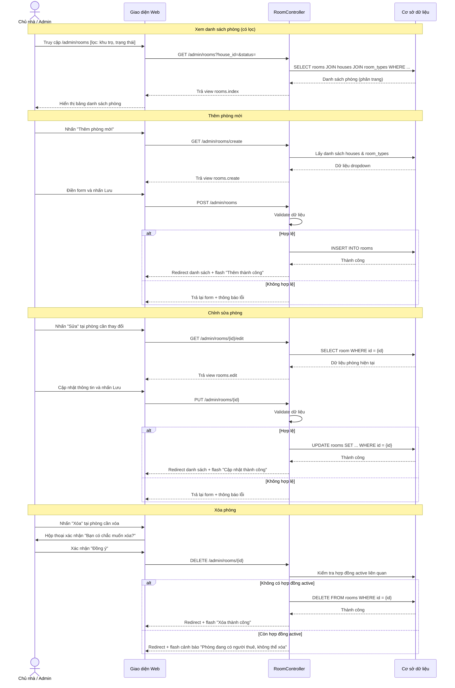

> **Hình X. Biểu đồ tuần tự chức năng Quản lý Phòng**

---

## 2.3.5. Thiết kế giao diện quản lý phòng

Giao diện quản lý phòng gồm các phần chính: thanh điều hướng bên trái, bộ lọc tìm kiếm, bảng danh sách phòng và chức năng thêm/sửa/xóa. Thanh điều hướng chứa các mục như Trang chủ (Dashboard), Quản lý Khu trọ, Quản lý Phòng, Khách thuê, Hợp đồng và Tài chính. Phần bộ lọc cho phép chủ nhà lọc nhanh theo **Khu trọ** và **Trạng thái phòng** (Trống / Đang thuê / Đang bảo trì). Bảng danh sách phòng hiển thị các thông tin từ cơ sở dữ liệu gồm: số phòng, khu trọ, loại phòng, tầng, diện tích, giá thuê và trạng thái hiện tại. Mỗi dòng có nút **Xem chi tiết**, **Sửa** và **Xóa** để thao tác trực tiếp. Phần thêm/sửa phòng cung cấp form nhập liệu đầy đủ với dropdown chọn khu trọ và loại phòng, trường nhập giá thuê, diện tích, số người tối đa và lựa chọn trạng thái. Giao diện giúp chủ nhà theo dõi và quản lý toàn bộ hệ thống phòng trọ một cách trực quan, nhanh chóng và hiệu quả.

> **Hình X. Giao diện Quản lý Phòng**

---

# 2.4. Module Quản lý Khách thuê

---

## 2.4.1. Giới thiệu chức năng quản lý khách thuê

Chức năng quản lý khách thuê giúp chủ nhà lưu trữ và quản lý đầy đủ thông tin cá nhân của từng người thuê phòng. Hệ thống cho phép thêm mới, chỉnh sửa và tra cứu thông tin người thuê bao gồm: họ tên, số CCCD/CMND, số điện thoại, địa chỉ thường trú, ngày sinh, giới tính và thông tin người liên hệ khẩn cấp. Mỗi khách thuê được liên kết với một tài khoản người dùng trong hệ thống, đảm bảo khả năng xác thực và truy cập cổng thông tin của người thuê.

### Tác nhân và biểu đồ ca sử dụng

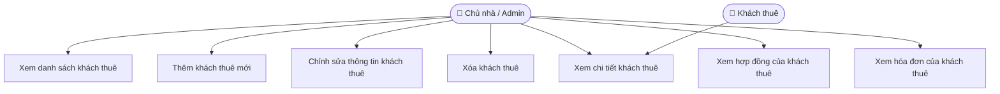

> **Hình X. Biểu đồ ca sử dụng chức năng Quản lý Khách thuê**

---

## 2.4.2. Thiết kế cơ sở dữ liệu quản lý khách thuê

**Mục đích:** Lưu trữ thông tin cá nhân, giấy tờ tùy thân và liên hệ của người thuê phòng.  
**Tên bảng:** `tenants`

| STT | Diễn giải | Tên trường | Kiểu dữ liệu | Ràng buộc | Ghi chú |
|-----|-----------|------------|--------------|-----------|----------|
| 1 | Mã khách thuê | id | bigint | PK | Tự động tăng |
| 2 | Mã tài khoản | user_id | bigint | FK, Not Null | Tham chiếu bảng `users` |
| 3 | Số CCCD/CMND | cccd | varchar(20) | Unique, Nullable | Số căn cước công dân |
| 4 | Số điện thoại | phone | varchar(15) | Nullable | |
| 5 | Địa chỉ thường trú | address | text | Nullable | |
| 6 | Quê quán | hometown | varchar(255) | Nullable | |
| 7 | Ngày sinh | birthday | date | Nullable | |
| 8 | Giới tính | gender | enum | Nullable | male / female / other |
| 9 | Ảnh đại diện | avatar_path | varchar(255) | Nullable | Đường dẫn file ảnh |
| 10 | Ảnh CCCD mặt trước | cccd_front_path | varchar(255) | Nullable | |
| 11 | Ảnh CCCD mặt sau | cccd_back_path | varchar(255) | Nullable | |
| 12 | Người liên hệ khẩn cấp | emergency_contact_name | varchar(255) | Nullable | |
| 13 | SĐT liên hệ khẩn cấp | emergency_contact_phone | varchar(15) | Nullable | |
| 14 | Ngày tạo | created_at | timestamp | | |
| 15 | Ngày cập nhật | updated_at | timestamp | | |

---

## 2.4.3. Quy trình quản lý khách thuê

Quản lý khách thuê bao gồm các thao tác chính: thêm mới, chỉnh sửa và xóa thông tin người thuê. Hệ thống đảm bảo tính toàn vẹn dữ liệu bằng cách kiểm tra ràng buộc trước khi xóa. Chi tiết như sau:

### Thêm mới khách thuê

| Thành phần | Nội dung chi tiết |
|------------|-------------------|
| **Mục đích** | Tạo hồ sơ khách thuê mới trong hệ thống để phục vụ ký kết hợp đồng và quản lý thông tin lâu dài. |
| **Các bước thực hiện** | 1. Chủ nhà chọn chức năng **Thêm khách thuê mới**.<br>2. Nhập thông tin: Họ tên, email (tạo tài khoản), CCCD, SĐT, địa chỉ, ngày sinh, giới tính, người liên hệ khẩn cấp và tải ảnh CCCD.<br>3. Hệ thống kiểm tra tính hợp lệ (email hợp lệ, CCCD không trùng).<br>4. Hệ thống tạo tài khoản user đồng thời với hồ sơ tenant và lưu vào cơ sở dữ liệu. |
| **Tham chiếu** | Bảng dữ liệu: `tenants`, `users` |

### Chỉnh sửa thông tin khách thuê

| Thành phần | Nội dung chi tiết |
|------------|-------------------|
| **Mục đích** | Cập nhật thông tin cá nhân khi có thay đổi như số điện thoại, địa chỉ hoặc ảnh CCCD. |
| **Các bước thực hiện** | 1. Chủ nhà chọn nút **Sửa** tại hồ sơ khách thuê.<br>2. Chỉnh sửa các trường cần cập nhật.<br>3. Hệ thống kiểm tra số CCCD không trùng với khách thuê khác.<br>4. Lưu thay đổi và làm mới danh sách. |
| **Tham chiếu** | Bảng dữ liệu: `tenants` |

### Xóa khách thuê

| Thành phần | Nội dung chi tiết |
|------------|-------------------|
| **Mục đích** | Loại bỏ hồ sơ khách thuê không còn giao dịch hoặc nhập sai. |
| **Các bước thực hiện** | 1. Chủ nhà chọn nút **Xóa** tại hồ sơ khách thuê.<br>2. Hệ thống hiển thị xác nhận xóa.<br>3. Kiểm tra ràng buộc: Nếu còn hợp đồng active thì từ chối và hiển thị cảnh báo.<br>4. Xóa hồ sơ và tài khoản liên quan sau khi xác nhận hợp lệ. |
| **Tham chiếu** | Bảng dữ liệu: `tenants`, `users`, `contracts` |

---

## 2.4.4. Thiết kế quy trình nghiệp vụ

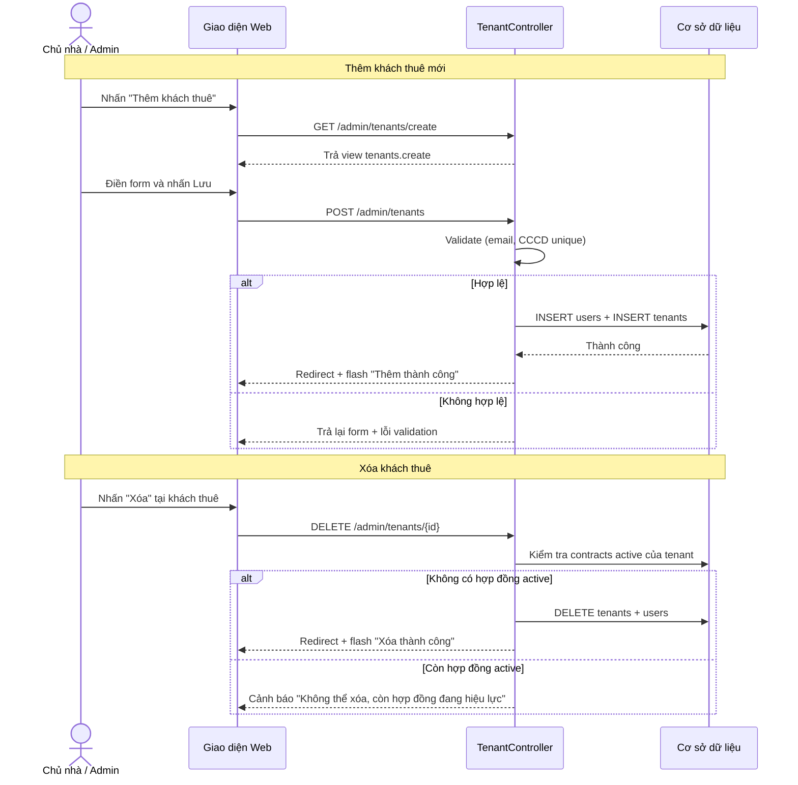

> **Hình X. Biểu đồ tuần tự chức năng Quản lý Khách thuê**

---

## 2.4.5. Thiết kế giao diện quản lý khách thuê

Giao diện quản lý khách thuê gồm bảng danh sách với các cột: họ tên, email, số CCCD, số điện thoại và số hợp đồng hiện tại. Chức năng tìm kiếm theo họ tên hoặc CCCD giúp tra cứu nhanh. Form thêm/sửa cung cấp đầy đủ các trường nhập liệu thông tin cá nhân, kèm theo tính năng tải ảnh CCCD mặt trước và mặt sau. Giao diện được thiết kế thân thiện, giúp chủ nhà quản lý hồ sơ khách thuê một cách toàn diện và chuyên nghiệp.

> **Hình X. Giao diện Quản lý Khách thuê**

---

# 2.5. Module Quản lý Hợp đồng

---

## 2.5.1. Giới thiệu chức năng quản lý hợp đồng

Chức năng quản lý hợp đồng là trung tâm của hệ thống quản lý phòng trọ, ghi nhận mối quan hệ pháp lý giữa chủ nhà và khách thuê. Hệ thống cho phép tạo hợp đồng mới khi khách bắt đầu thuê phòng, theo dõi thời hạn, tiền cọc, giá thuê theo hợp đồng và xử lý các trường hợp hết hạn hoặc thanh lý sớm. Chủ nhà có thể xuất hợp đồng dưới dạng file PDF để lưu trữ và ký kết.

### Tác nhân và biểu đồ ca sử dụng

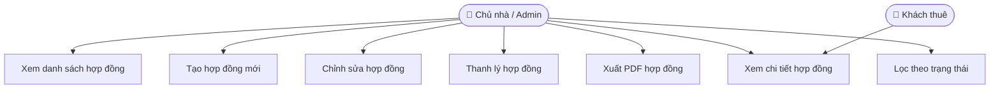

> **Hình X. Biểu đồ ca sử dụng chức năng Quản lý Hợp đồng**

---

## 2.5.2. Thiết kế cơ sở dữ liệu quản lý hợp đồng

**Mục đích:** Lưu trữ thông tin hợp đồng thuê phòng giữa chủ nhà và khách thuê.  
**Tên bảng:** `contracts`

| STT | Diễn giải | Tên trường | Kiểu dữ liệu | Ràng buộc | Ghi chú |
|-----|-----------|------------|--------------|-----------|----------|
| 1 | Mã hợp đồng | id | bigint | PK | Tự động tăng |
| 2 | Mã phòng | room_id | bigint | FK, Not Null | Tham chiếu bảng `rooms` |
| 3 | Mã khách thuê | tenant_id | bigint | FK, Not Null | Tham chiếu bảng `tenants` |
| 4 | Ngày bắt đầu | start_date | date | Not Null | |
| 5 | Ngày kết thúc | end_date | date | Not Null | |
| 6 | Tiền cọc | deposit | decimal(12,0) | Not Null | Đơn vị: VNĐ |
| 7 | Giá thuê hợp đồng | monthly_price | decimal(12,0) | Not Null | VNĐ/tháng |
| 8 | Số người ở thực tế | occupants | int | Not Null | Mặc định: 1 |
| 9 | File PDF hợp đồng | pdf_path | varchar(255) | Nullable | |
| 10 | Trạng thái | status | enum | Not Null | active / expired / terminated |
| 11 | Ngày thanh lý | terminated_at | date | Nullable | Thanh lý trước hạn |
| 12 | Tiền cọc hoàn lại | deposit_refund | decimal(12,0) | Not Null | Mặc định: 0 |
| 13 | Ghi chú | notes | text | Nullable | Điều khoản bổ sung |
| 14 | Ngày tạo | created_at | timestamp | | |
| 15 | Ngày cập nhật | updated_at | timestamp | | |

---

## 2.5.3. Quy trình quản lý hợp đồng

### Tạo hợp đồng mới

| Thành phần | Nội dung chi tiết |
|------------|-------------------|
| **Mục đích** | Ghi nhận quan hệ thuê phòng chính thức giữa chủ nhà và khách thuê, làm cơ sở xuất hóa đơn hàng tháng. |
| **Các bước thực hiện** | 1. Chủ nhà chọn chức năng **Tạo hợp đồng mới**.<br>2. Chọn Phòng, Khách thuê từ dropdown; nhập ngày bắt đầu, ngày kết thúc, tiền cọc, giá thuê, số người ở.<br>3. Hệ thống kiểm tra: phòng chưa có hợp đồng active, ngày kết thúc sau ngày bắt đầu.<br>4. Lưu hợp đồng, tự động cập nhật trạng thái phòng sang `rented`. |
| **Tham chiếu** | Bảng dữ liệu: `contracts`, `rooms`, `tenants` |

### Thanh lý hợp đồng

| Thành phần | Nội dung chi tiết |
|------------|-------------------|
| **Mục đích** | Ghi nhận việc chấm dứt hợp đồng trước hoặc đúng hạn, xử lý hoàn cọc và giải phóng phòng. |
| **Các bước thực hiện** | 1. Chủ nhà chọn **Thanh lý** tại hợp đồng cần kết thúc.<br>2. Nhập ngày thanh lý và số tiền cọc hoàn lại cho khách.<br>3. Hệ thống cập nhật trạng thái hợp đồng sang `terminated`, cập nhật phòng về `available`. |
| **Tham chiếu** | Bảng dữ liệu: `contracts`, `rooms` |

---

## 2.5.4. Thiết kế quy trình nghiệp vụ

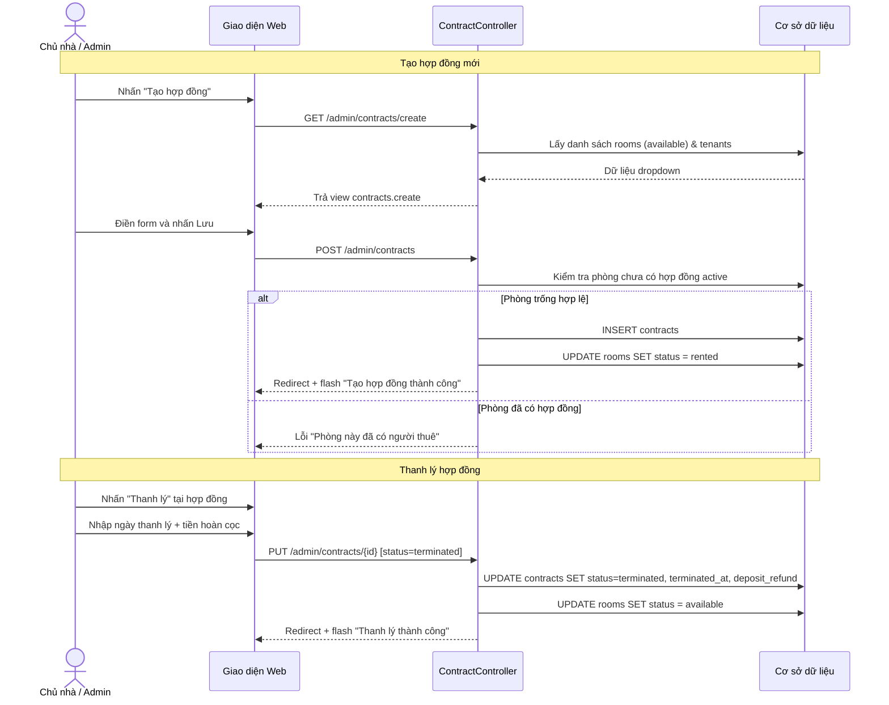

> **Hình X. Biểu đồ tuần tự chức năng Quản lý Hợp đồng**

---

## 2.5.5. Thiết kế giao diện quản lý hợp đồng

Giao diện quản lý hợp đồng hiển thị danh sách với các cột: mã hợp đồng, phòng, khách thuê, ngày bắt đầu, ngày kết thúc, giá thuê và trạng thái (Đang hiệu lực / Hết hạn / Đã thanh lý). Chức năng bộ lọc theo trạng thái giúp chủ nhà nhanh chóng xác định các hợp đồng sắp hết hạn. Mỗi hợp đồng có nút **Xem chi tiết**, **Sửa**, **Xuất PDF** và **Thanh lý**. Form tạo hợp đồng sử dụng dropdown chọn phòng và khách thuê, kết hợp với bộ chọn ngày thuận tiện.

> **Hình X. Giao diện Quản lý Hợp đồng**

---

# 2.6. Module Quản lý Hóa đơn & Thu tiền

---

## 2.6.1. Giới thiệu chức năng quản lý hóa đơn

Chức năng quản lý hóa đơn và thu tiền cho phép chủ nhà tạo và theo dõi hóa đơn hàng tháng cho từng phòng có hợp đồng active. Hệ thống tự động tính toán tiền phòng, tiền điện, tiền nước và các phí dịch vụ khác dựa trên chỉ số đã nhập. Chủ nhà có thể cập nhật trạng thái thanh toán (Chưa thanh toán / Đã thanh toán một phần / Hoàn tất) và theo dõi công nợ theo thời gian thực.

### Tác nhân và biểu đồ ca sử dụng

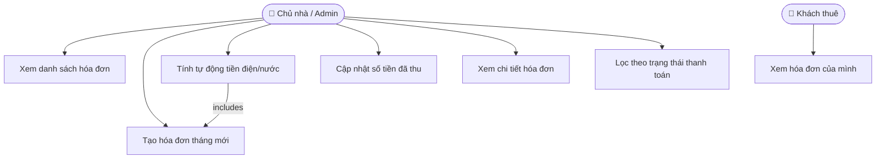

> **Hình X. Biểu đồ ca sử dụng chức năng Quản lý Hóa đơn**

---

## 2.6.2. Thiết kế cơ sở dữ liệu quản lý hóa đơn

**Mục đích:** Lưu trữ thông tin hóa đơn thu tiền phòng hàng tháng, bao gồm các khoản phí và trạng thái thanh toán.  
**Tên bảng:** `invoices`

| STT | Diễn giải | Tên trường | Kiểu dữ liệu | Ràng buộc | Ghi chú |
|-----|-----------|------------|--------------|-----------|----------|
| 1 | Mã hóa đơn | id | bigint | PK | Tự động tăng |
| 2 | Mã hợp đồng | contract_id | bigint | FK, Not Null | Tham chiếu bảng `contracts` |
| 3 | Tháng | month | tinyint | Not Null | Giá trị 1–12 |
| 4 | Năm | year | smallint | Not Null | |
| 5 | Tiền phòng | room_fee | decimal(12,0) | Not Null | VNĐ |
| 6 | Tiền điện | electricity_fee | decimal(12,0) | Not Null | Mặc định: 0 |
| 7 | Tiền nước | water_fee | decimal(12,0) | Not Null | Mặc định: 0 |
| 8 | Phí dịch vụ khác | service_fee | decimal(12,0) | Not Null | Mặc định: 0 |
| 9 | Tổng cộng | total | decimal(12,0) | Not Null | Tự tính |
| 10 | Đã thanh toán | paid_amount | decimal(12,0) | Not Null | Mặc định: 0 |
| 11 | Còn nợ | debt | decimal(12,0) | Not Null | = total - paid_amount |
| 12 | Hạn chót nộp tiền | due_date | date | Not Null | |
| 13 | Trạng thái | status | enum | Not Null | unpaid / partial / paid / overdue |
| 14 | Ghi chú | notes | text | Nullable | |
| 15 | Ngày tạo | created_at | timestamp | | |
| 16 | Ngày cập nhật | updated_at | timestamp | | |

> **Ràng buộc:** Unique(`contract_id`, `month`, `year`) — Mỗi hợp đồng chỉ có 1 hóa đơn/tháng.

---

## 2.6.3. Quy trình quản lý hóa đơn

### Tạo hóa đơn tháng mới

| Thành phần | Nội dung chi tiết |
|------------|-------------------|
| **Mục đích** | Phát sinh hóa đơn thu tiền hàng tháng cho từng phòng đang có hợp đồng active. |
| **Các bước thực hiện** | 1. Chủ nhà chọn **Tạo hóa đơn** và chọn hợp đồng cần lập hóa đơn.<br>2. Chọn tháng/năm. Hệ thống tự động điền tiền phòng từ hợp đồng.<br>3. Hệ thống tự động tính tiền điện/nước từ chỉ số đã nhập (nếu có).<br>4. Chủ nhà kiểm tra, điều chỉnh và lưu hóa đơn. |
| **Tham chiếu** | Bảng dữ liệu: `invoices`, `contracts`, `meter_readings` |

### Cập nhật thu tiền

| Thành phần | Nội dung chi tiết |
|------------|-------------------|
| **Mục đích** | Ghi nhận số tiền khách đã nộp, cập nhật trạng thái thanh toán và số nợ còn lại. |
| **Các bước thực hiện** | 1. Chủ nhà tìm hóa đơn cần cập nhật.<br>2. Nhập số tiền khách đã nộp vào trường `paid_amount`.<br>3. Hệ thống tự tính `debt = total - paid_amount` và cập nhật trạng thái tương ứng (`partial` / `paid`).<br>4. Lưu và làm mới danh sách. |
| **Tham chiếu** | Bảng dữ liệu: `invoices` |

---

## 2.6.4. Thiết kế quy trình nghiệp vụ

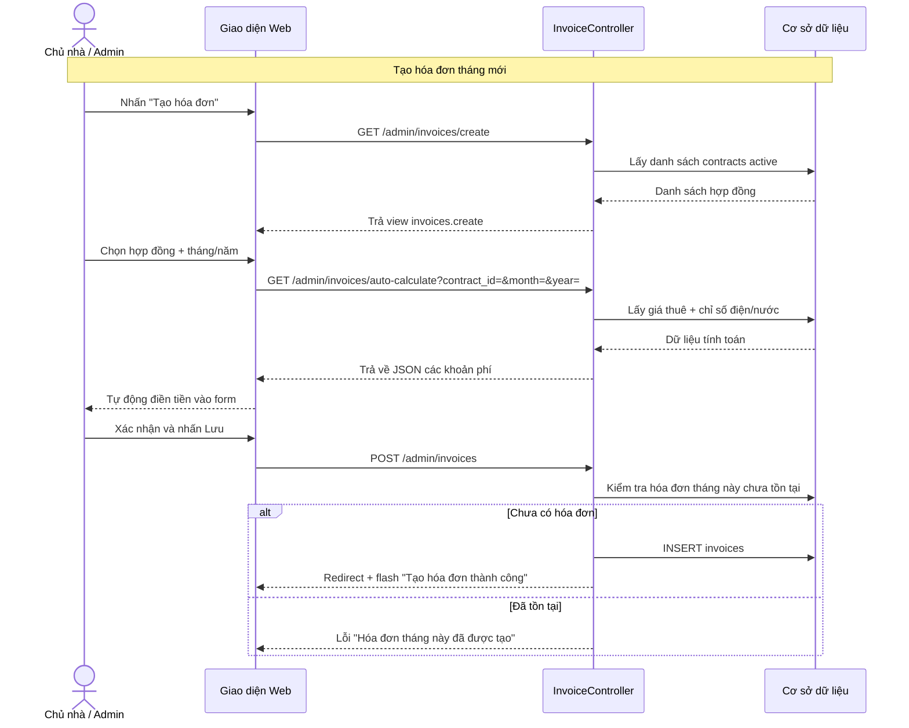

> **Hình X. Biểu đồ tuần tự chức năng Quản lý Hóa đơn**

---

## 2.6.5. Thiết kế giao diện quản lý hóa đơn

Giao diện quản lý hóa đơn hiển thị bảng danh sách với các cột: phòng, khách thuê, tháng/năm, tổng tiền, số đã nộp, còn nợ và trạng thái. Bộ lọc theo trạng thái (Chưa thanh toán / Quá hạn / Hoàn tất) giúp chủ nhà ưu tiên xử lý công nợ. Form tạo hóa đơn tích hợp tính năng **tự động tính phí** khi chọn hợp đồng và tháng/năm. Giao diện giúp chủ nhà kiểm soát thu nhập và công nợ một cách chặt chẽ, minh bạch.

> **Hình X. Giao diện Quản lý Hóa đơn**

---

# 2.7. Module Quản lý Chỉ số Điện/Nước

---

## 2.7.1. Giới thiệu chức năng quản lý chỉ số điện/nước

Chức năng quản lý chỉ số điện/nước cho phép chủ nhà ghi nhận chỉ số công tơ điện và đồng hồ nước hàng tháng của từng phòng. Hệ thống tự động tính lượng tiêu thụ (chỉ số mới – chỉ số cũ) và thành tiền dựa trên đơn giá tại thời điểm ghi. Dữ liệu này được sử dụng làm căn cứ tính tiền điện/nước trong hóa đơn hàng tháng.

### Tác nhân và biểu đồ ca sử dụng

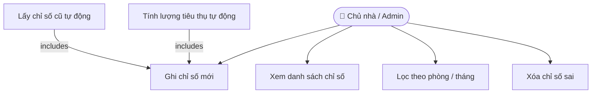

> **Hình X. Biểu đồ ca sử dụng chức năng Quản lý Chỉ số Điện/Nước**

---

## 2.7.2. Thiết kế cơ sở dữ liệu

**Mục đích:** Lưu trữ chỉ số điện/nước hàng tháng của từng phòng, làm cơ sở tính tiền trong hóa đơn.  
**Tên bảng:** `meter_readings`

| STT | Diễn giải | Tên trường | Kiểu dữ liệu | Ràng buộc | Ghi chú |
|-----|-----------|------------|--------------|-----------|----------|
| 1 | Mã bản ghi | id | bigint | PK | Tự động tăng |
| 2 | Mã phòng | room_id | bigint | FK, Not Null | Tham chiếu bảng `rooms` |
| 3 | Mã dịch vụ | service_id | bigint | FK, Not Null | Điện hoặc Nước |
| 4 | Tháng | month | tinyint | Not Null | 1–12 |
| 5 | Năm | year | smallint | Not Null | |
| 6 | Chỉ số đầu kỳ | old_value | decimal(10,2) | Not Null | Mặc định: 0 |
| 7 | Chỉ số cuối kỳ | new_value | decimal(10,2) | Not Null | Mặc định: 0 |
| 8 | Lượng tiêu thụ | consumption | decimal(10,2) | Computed | = new_value - old_value (tự tính) |
| 9 | Đơn giá | unit_price | decimal(12,0) | Not Null | VNĐ/kWh hoặc VNĐ/m³ |
| 10 | Thành tiền | total_amount | decimal(12,0) | Not Null | = consumption × unit_price |
| 11 | Người ghi | recorded_by | varchar(255) | Nullable | Tên người thực hiện |
| 12 | Ngày tạo | created_at | timestamp | | |
| 13 | Ngày cập nhật | updated_at | timestamp | | |

> **Ràng buộc:** Unique(`room_id`, `service_id`, `month`, `year`) — Mỗi phòng chỉ có 1 chỉ số mỗi loại dịch vụ mỗi tháng.

---

## 2.7.3. Quy trình ghi chỉ số

### Ghi chỉ số mới

| Thành phần | Nội dung chi tiết |
|------------|-------------------|
| **Mục đích** | Ghi nhận chỉ số công tơ điện/đồng hồ nước cuối tháng của từng phòng. |
| **Các bước thực hiện** | 1. Chủ nhà chọn chức năng **Ghi chỉ số mới**.<br>2. Chọn Phòng, Loại dịch vụ (Điện/Nước), Tháng/Năm.<br>3. Hệ thống tự động điền chỉ số cũ (lấy từ bản ghi tháng trước).<br>4. Chủ nhà nhập chỉ số mới; hệ thống tự tính tiêu thụ và thành tiền.<br>5. Lưu vào cơ sở dữ liệu. |
| **Tham chiếu** | Bảng dữ liệu: `meter_readings`, `rooms`, `services` |

---

## 2.7.4. Thiết kế quy trình nghiệp vụ

```mermaid
sequenceDiagram
    actor Admin as Chủ nhà / Admin
    participant UI as Giao diện Web
    participant Controller as MeterReadingController
    participant DB as Cơ sở dữ liệu

    Note over Admin,DB: Ghi chỉ số điện/nước
    Admin->>UI: Nhấn "Ghi chỉ số mới"
    UI->>Controller: GET /admin/meter-readings/create
    Controller->>DB: Lấy danh sách phòng + dịch vụ
    DB-->>Controller: Dữ liệu dropdown
    Controller-->>UI: Trả view meter-readings.create

    Admin->>UI: Chọn phòng + dịch vụ + tháng/năm
    UI->>Controller: GET /admin/meter-readings/get-old-value?room_id=&service_id=&month=&year=
    Controller->>DB: SELECT new_value FROM meter_readings WHERE tháng trước
    DB-->>Controller: Chỉ số cũ
    Controller-->>UI: Trả về JSON chỉ số cũ
    UI-->>Admin: Tự động điền chỉ số đầu kỳ

    Admin->>UI: Nhập chỉ số mới + đơn giá → nhấn Lưu
    UI->>Controller: POST /admin/meter-readings
    Controller->>Controller: Tính consumption = new - old; total = consumption × unit_price
    Controller->>DB: INSERT meter_readings
    DB-->>Controller: Thành công
    Controller-->>UI: Redirect + flash "Ghi chỉ số thành công"
```

> **Hình X. Biểu đồ tuần tự chức năng Quản lý Chỉ số Điện/Nước**

---

## 2.7.5. Thiết kế giao diện quản lý chỉ số điện/nước

Giao diện quản lý chỉ số điện/nước hiển thị bảng danh sách gồm: phòng, loại dịch vụ, tháng/năm, chỉ số đầu – cuối kỳ, lượng tiêu thụ, đơn giá và thành tiền. Bộ lọc theo phòng và tháng/năm giúp tra cứu nhanh. Form ghi chỉ số tích hợp tính năng **tự động lấy chỉ số cũ** từ tháng trước và **tự tính thành tiền** ngay khi nhập chỉ số mới. Giao diện giúp chủ nhà ghi nhận và kiểm soát tiêu thụ điện/nước chính xác, minh bạch.

> **Hình X. Giao diện Quản lý Chỉ số Điện/Nước**

---

# 2.8. Module Quản lý Báo cáo Sự cố

---

## 2.8.1. Giới thiệu chức năng quản lý báo cáo sự cố

Chức năng quản lý báo cáo sự cố (maintenance tickets) cho phép khách thuê gửi yêu cầu sửa chữa, bảo trì trong phòng hoặc khu trọ trực tiếp qua hệ thống. Chủ nhà tiếp nhận, phân loại mức độ ưu tiên và cập nhật tiến trình xử lý. Hệ thống hỗ trợ đính kèm ảnh chụp sự cố và ghi nhận phản hồi từ chủ nhà, giúp quy trình bảo trì diễn ra minh bạch và có thể theo dõi lịch sử.

### Tác nhân và biểu đồ ca sử dụng

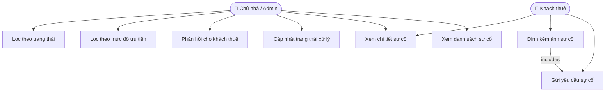

> **Hình X. Biểu đồ ca sử dụng chức năng Quản lý Báo cáo Sự cố**

---

## 2.8.2. Thiết kế cơ sở dữ liệu

**Mục đích:** Lưu trữ thông tin các yêu cầu sửa chữa, bảo trì do khách thuê gửi lên.  
**Tên bảng:** `maintenance_tickets`

| STT | Diễn giải | Tên trường | Kiểu dữ liệu | Ràng buộc | Ghi chú |
|-----|-----------|------------|--------------|-----------|----------|
| 1 | Mã phiếu | id | bigint | PK | Tự động tăng |
| 2 | Mã hợp đồng | contract_id | bigint | FK, Not Null | Xác định phòng + khách thuê |
| 3 | Tiêu đề sự cố | title | varchar(255) | Not Null | VD: Bóng đèn bị cháy |
| 4 | Mô tả chi tiết | description | text | Nullable | |
| 5 | Ảnh sự cố | image_path | varchar(255) | Nullable | |
| 6 | Mức độ ưu tiên | priority | enum | Not Null | low / medium / high |
| 7 | Trạng thái | status | enum | Not Null | pending / in_progress / done / cancelled |
| 8 | Phản hồi của Admin | admin_response | text | Nullable | |
| 9 | Thời điểm hoàn thành | resolved_at | timestamp | Nullable | |
| 10 | Ngày tạo | created_at | timestamp | | |
| 11 | Ngày cập nhật | updated_at | timestamp | | |

---

## 2.8.3. Quy trình quản lý báo cáo sự cố

### Khách thuê gửi báo cáo sự cố

| Thành phần | Nội dung chi tiết |
|------------|-------------------|
| **Mục đích** | Cho phép khách thuê thông báo sự cố trong phòng đến chủ nhà qua hệ thống. |
| **Các bước thực hiện** | 1. Khách thuê đăng nhập vào cổng thông tin và chọn **Báo cáo sự cố**.<br>2. Nhập tiêu đề, mô tả chi tiết sự cố và tải ảnh đính kèm.<br>3. Hệ thống tự động gắn hợp đồng đang active của khách.<br>4. Lưu phiếu với trạng thái mặc định `pending` và gửi thông báo cho chủ nhà. |
| **Tham chiếu** | Bảng dữ liệu: `maintenance_tickets`, `contracts` |

### Chủ nhà xử lý sự cố

| Thành phần | Nội dung chi tiết |
|------------|-------------------|
| **Mục đích** | Chủ nhà tiếp nhận, cập nhật tiến trình và phản hồi kết quả xử lý sự cố. |
| **Các bước thực hiện** | 1. Chủ nhà xem danh sách sự cố, ưu tiên phiếu `high` và `pending`.<br>2. Chọn phiếu cần xử lý, cập nhật trạng thái sang `in_progress`.<br>3. Sau khi hoàn tất, cập nhật trạng thái sang `done`, nhập phản hồi và lưu thời điểm hoàn thành.<br>4. Hệ thống gửi thông báo đến khách thuê về kết quả xử lý. |
| **Tham chiếu** | Bảng dữ liệu: `maintenance_tickets` |

---

## 2.8.4. Thiết kế quy trình nghiệp vụ

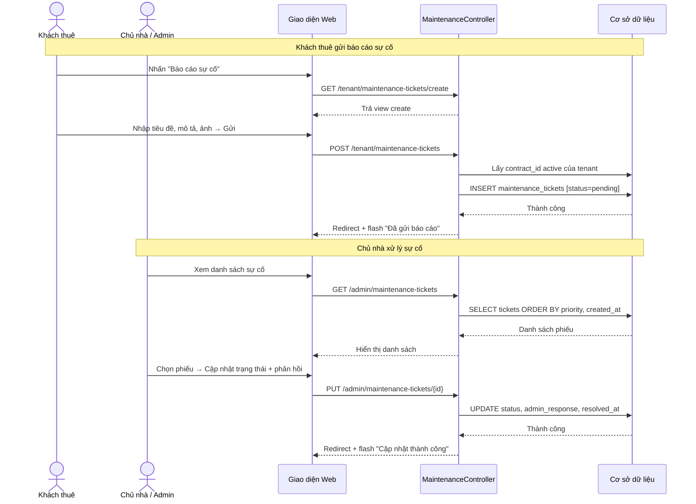

> **Hình X. Biểu đồ tuần tự chức năng Quản lý Báo cáo Sự cố**

---

## 2.8.5. Thiết kế giao diện quản lý báo cáo sự cố

Giao diện quản lý báo cáo sự cố hiển thị bảng danh sách với các cột: tiêu đề, phòng, khách thuê, mức độ ưu tiên (thẻ màu: Cao/Trung bình/Thấp), trạng thái và thời gian tạo. Bộ lọc theo mức độ ưu tiên và trạng thái xử lý giúp chủ nhà ưu tiên hành động. Giao diện chi tiết phiếu hiển thị ảnh sự cố, mô tả đầy đủ và ô nhập phản hồi từ chủ nhà. Phía khách thuê, giao diện đơn giản với form gửi sự cố và danh sách theo dõi trạng thái xử lý.

> **Hình X. Giao diện Quản lý Báo cáo Sự cố**
